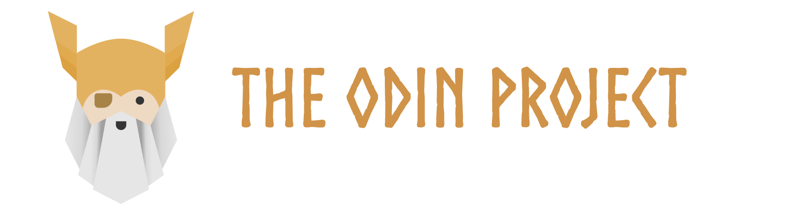

#### THE ODIN PROJECT

The work & projects found in this repo belongs to myself - [Andre Coetzer](https://github.com/acoetzer "The Odin Project Logo Banner")

 

### Repository Description

 

This [repo](https://github.com/acoetzer/the-odin-project-course "Link to the current repository") contains all projects and assignments given by [The Odin Project](https://www.theodinproject.com/ "Link to The Odin Project website") course. It's intended purpose is to store my progress and share my work with other coding buddies or the Odin community. I still consider myself a student on the path of full stack development.

_If you would like to code along or mentor me, please feel free to reach out to me on discord, username is_ **acoetzer#8530**

 

### Project List

*Currently Empty*
